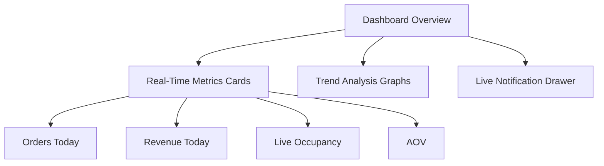

# CafeCanvas Store Admin User Guide

**Last Updated:** June 12, 2026  
**Audience:** Restaurant Owners, General Managers, and Platform Administrators

Welcome to the **CafeCanvas Store Admin User Guide**. This document serves as the operations manual for the Store Admin interface (accessible via Electron Desktop App or standard Web browsers at `app.cafecanvas.bar`). It details every dashboard tab, configuration option, and system configuration step required to run your food and beverage business.

---

## 1. Executive Dashboard (Analytics & Insights)

The Executive Dashboard is your real-time central operations panel. It aggregates live operational and financial statistics from your active location.



### 1.1 Real-Time Metrics Cards
* **Orders Today:** The running count of order tickets created since the daily system reset. Cancelled orders are excluded automatically.
* **Revenue Today:** The sum of all bills marked as `paid`. Displayed in Rupees but calculated internally from database integer paise to ensure audit alignment.
* **Live Occupancy:** The current proportion of dining tables in use. It calculates the ratio of occupied tables to the total table assets configured.
* **Average Order Value (AOV):** Represents the ticket average for the day:
  $$\text{AOV} = \frac{\text{Total Paid Revenue}}{\text{Total Paid Orders}}$$
  Use this metric to measure the performance of upselling and menu item optimization.

### 1.2 Sales Trends & Graphs
* **Hourly Performance Chart:** Displays sales activity in hourly bins. Useful for organizing kitchen staff shifts.
* **Top Items Distribution:** A pie chart representing the menu items that generate the highest sales volume.
* **Real-time Live Sync Indicator:** A green status dot showing that the Supabase Realtime channel is active. Operational alerts (e.g., customer checked in, order placed) slide into the dashboard live.

---

## 2. Menu Catalog & Modifiers

Configure your digital and POS menus, catalog hierarchies, items, and upsell options here.

### 2.1 Catalog Hierarchy
1. **Categories:** Create group levels (e.g., *Specialty Coffee*, *Stone Oven Pizzas*, *Desserts*). Set the sort order using drag-and-drop handles. Use the visibility toggle to hide seasonal groups from the storefront without deleting them.
2. **Menu Items:** Add specific dishes or beverages. Each item requires:
   * **Name & Description:** Customer-facing details.
   * **Availability Status:** Quick-toggle to mark an item "Out of Stock". This updates the storefront menu instantly.

```
+-----------------------------------------------------------+
|                     Catalog Architecture                  |
|                                                           |
|  [ Category: Hot Coffees ]                                |
|      |                                                    |
|      +-- [ Menu Item: Espresso ] (Base Price: 15000 paise)|
|             |                                             |
|             +-- [ Modifier Group: Milk Type ]             |
|                    |-- Whole Milk (+0 paise)              |
|                    |-- Almond Milk (+3000 paise)          |
|                    |-- Oat Milk (+4000 paise)             |
+-----------------------------------------------------------+
```

### 2.2 Modifier Groups & Custom Options
Modifiers allow you to specify add-ons, sizes, and customizations:
* **Modifier Group Properties:** Set selection requirements. For example, "Milk Type" can be marked *Required (Min: 1, Max: 1)*, whereas "Add Extra Syrup Shot" is *Optional (Min: 0, Max: 3)*.
* **Sub-items (Modifiers):** Define items inside the modifier groups along with their additional pricing.

### 2.3 The "Paise Pricing" Principle
To prevent floating-point calculation errors, CafeCanvas stores all monetary values as integers in paise.

> [!IMPORTANT]
> **Pricing Rule:** In the database, ₹1.00 is represented as `100` paise. When you edit prices in the Store Admin:
> * Enter the price in standard decimal format (e.g., `250.50` for ₹250.50).
> * The system automatically multiplies it by 100 (`25050`) before performing database writes.
> * This guarantees that your CGST/SGST calculations and Razorpay payment parameters are rounded consistently.

---

## 3. Floor Plan & Table QR Management

Configure your physical dining room layout to organize order routing and customer check-ins.

### 3.1 Managing Sections & Floors
* **Create Sections:** Group tables into zones (e.g., *Main Dining Hall*, *Rooftop Deck*, *Poolside Patio*).
* **Add Table Assets:** Add table profiles with a designation number (e.g., "T1", "Bar-3", "R-10"), seating capacity, and section assignment.

### 3.2 Dynamic Table States
The admin monitor updates table status circles dynamically using the following states:
* 🟢 **Available:** Table is empty; ready for new check-ins.
* 🔴 **Occupied:** Customers are seated. An active table session is running, and orders are open.
* 🟡 **Reserved:** Pre-booked table.
* 🔵 **Cleaning:** Customers have checked out. The table is flagged for busser attention.

### 3.3 Table QR Code Generator
Every table configuration contains a unique QR code linked directly to its ID.

```
       [ Scan QR Table Card ]
                 |
                 v
  https://{slug}.cafecanvas.bar/table/{table-id}
                 |
                 v
   [ Customer OTP Check-In Screen ]
```

* **How to Download QRs:** Go to *Tables & Layout* ➔ *Select Section* ➔ Click *Download PDF QR Sheet*. This generates printable vector QR cards.
* **Customer Scan Workflow:** When scanned, the QR code redirects the customer to:
  `https://{tenant-slug}.cafecanvas.bar/table/{table-id}`
  This triggers the OTP check-in screen, registering their session under that table.

---

## 4. Billing Operating System (Billing OS)

Manage checkout, print receipts, and configure billing parameters in the Billing OS tab.

### 4.1 Order Status Tracking
Monitor order lifecycle transitions in real-time:
$$\text{Pending} \longrightarrow \text{Confirmed} \longrightarrow \text{Preparing} \longrightarrow \text{Served} \longrightarrow \text{Billed}$$

* **Bill Auto-Generation:** Once all active orders associated with a table session are updated to the `served` state, the POS enables the "Generate Bill" action.

### 4.2 Invoice Directories
Browse past records in the Invoices tab. Use filters to sort by:
* **Status:** Unpaid, Paid, or Cancelled.
* **Cashier Shift:** View invoices processed by specific employee accounts.
* **Compliance Export:** Click *Export CSV* to pull transaction lists matching Indian GST audit formatting requirements.

### 4.3 Receipt Configuration & Previews
* **Dynamic Receipt Mockup:** A panel displays a live preview of the receipt before printing.
* **Layout Adjustments:**
  * Toggle paper widths between **80mm (3-inch)** standard thermal rolls and **58mm (2-inch)** narrow slips.
  * Edit custom **Header Texts** (e.g., Café greeting, branch phone, FSSAI number, GSTIN registration code).
  * Set a customized **Footer Message** (e.g., *"Powered by CafeCanvas | Thank you for visiting!"*).

---

## 5. Payment Gateways & Printers

Integrate payment channels and local point-of-sale hardware terminals.

### 5.1 Razorpay Credentials Config
Enter your credentials to enable digital storefront checkout:
* **Key ID & Key Secret:** Copy these keys from your Razorpay Dashboard settings.
* **Safe Encryption:** CafeCanvas encrypts keys using DB-level PGCrypto before storing them. They are never transmitted in API response payloads.
* **UPI ID Routing:** Add your merchant UPI VPA (e.g., `mycafe@hdfcbank`). This enables dynamic UPI QR codes on the customer's phone if card processing gateways are down.

> [!WARNING]
> **Key Validity:** Incorrect Razorpay keys will cause payment verifications to fail at checkout. Test your integration by creating a ₹1.00 payment item.

### 5.2 Thermal Printer WebUSB Pairing
CafeCanvas supports direct thermal receipt printing from Web browsers and Electron apps without installing drivers, using the native **WebUSB API**.

```
[ Connect USB Printer ] ➔ [ Click "Pair USB Printer" ] ➔ [ Select Device from Sheet ] ➔ [ Print Test Page ]
```

**Step-by-Step Pairing Instructions:**
1. Connect your 80mm or 58mm ESC/POS thermal printer to your computer using a USB cable.
2. Ensure the printer is powered on and paper is loaded.
3. In the Store Admin panel, navigate to **Settings** ➔ **Hardware & Printers**.
4. Click the **Pair USB Printer** button. A browser device selection sheet will slide down.
5. Select your thermal printer from the list (it may appear as "USB Printing Support" or "Generic ESC/POS Printer") and click **Connect**.
6. Once paired, click **Print Test Page** to verify paper alignment and font rendering.

---

## 6. Legal & Policies settings

Review and configure your storefront legal declarations to ensure compliance.

* **Tenant Policies Panel:** In Settings, you can review the platform's default templates or import your custom legal declarations:
  * **Privacy Policy:** Discloses how customer check-in information (name and phone) is processed.
  * **Terms of Service:** Outlines diner ordering rules, refund procedures, and payment agreements.
* **Storefront Links:** Dynamic links to your policies are displayed at the bottom of the Customer Storefront digital checkout screen.
* **FSSAI & GSTIN Overlay:** If configured, your FSSAI License Number and GSTIN are overlaid on legal screens and digital receipts automatically.

---

## 7. Audit Log Viewer (Compliance Tracking)

The Audit Log Viewer provides an unalterable history of database changes. It acts as your platform audit trail.

### 7.1 Tracked Activity Logs
The viewer logs the following administrative activities:
* **Staff Access Updates:** Modifying a staff account's role (e.g., changing a waiter to a manager).
* **Price Modifications:** Updates to menu item pricing records, showing the original price vs. the updated price in paise.
* **Transaction Overrides:** Manual adjustments to finalized bills or manual cash drawer openings.
* **Integration Edits:** Alterations to Razorpay key credentials or webhook targets.

### 7.2 GST Compliance Reviews
All log timestamps are normalized to Indian Standard Time (IST) for tax audit compatibility. In the event of a regulatory review, filters allow you to isolate and export logs matching specific timeframes.
