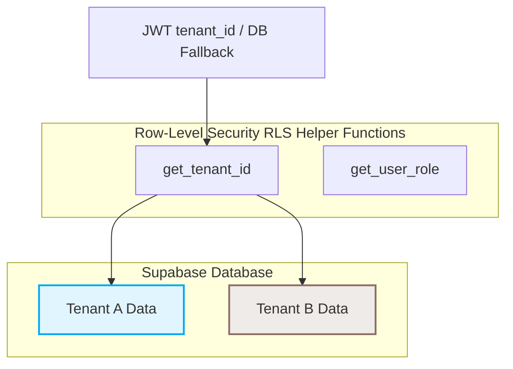

# Privacy Policy

**Last Updated:** June 12, 2026

Welcome to **CafeCanvas** (the "Platform"), a Multi-Tenant Software-as-a-Service (SaaS) Restaurant Operating System. CafeCanvas is operated to enable restaurant tenants ("Tenants") to manage storefronts, table sessions, orders, billing, and kitchen workflows.

This Privacy Policy explains how CafeCanvas collects, isolates, uses, and safeguards information when:
1. Tenants and their authorized staff ("Staff Users") access our platform dashboards, Electron Store Admin app, and Flutter Staff POS.
2. Diners and patrons ("Customers") visit a Tenant’s QR-enabled digital menu, check in at a table, or make payments via the customer storefront.

---

## 1. Multi-Tenant SaaS Isolation & Database Security

CafeCanvas is built on a single-instance, multi-tenant database model. We enforce absolute isolation of Tenant data to prevent unauthorized access or accidental exposure across boundaries.

### 1.1 Tenant Scoping via RLS
* **Database Isolation:** All data records in our database contain a `tenant_id` field. We employ PostgreSQL **Row-Level Security (RLS)** policies on all tables (such as `orders`, `bills`, `menu_items`, `tables`, `table_sessions`, etc.).
* **JWT Hooks and DB Fallbacks:** When a user logs in, their tenant identifier is retrieved from the Custom JWT Claims Hook (`inject_tenant_claims`). If the JWT claims are absent, the database automatically falls back to querying `staff_accounts` via `auth.uid()`.
* **Zero Cross-Tenant Leakage:** RLS policies prevent database reads, inserts, updates, or deletes unless the actor's verified `tenant_id` matches the target record's `tenant_id`. Under no circumstances can Tenant A view, query, or modify the customers, transactions, menu items, or configurations of Tenant B.

> [!IMPORTANT]
> **Tenant Isolation Guard:** Any database query that fails to resolve a valid `tenant_id` from either the JWT session or the database fallback is rejected immediately. Sessions with a null `tenant_id` are halted, and the transaction is terminated.

---

## 2. Information We Collect and Process

We collect information directly from Staff Users and Customers to provide the restaurant management services.

### 2.1 Customer (Diner) Data
When a Customer visits a Tenant's café or restaurant, scans a QR code, or checks in at a table:
* **Identification Details:** Customer Name and Phone Number (OTP verified via MSG91 or SMS gateways).
* **Table Sessions:** Table number, session identifiers (`started_at`, `ended_at`, status: `active` / `closed`), and customer check-in timestamps.
* **Order History:** Menu items selected, quantities, modification details, unit prices, total value of order, and fulfillment status (`pending`, `confirmed`, `preparing`, `served`, `cancelled`).
* **Technical Metadata:** Device browser details, operating system, and IP address for security logging.

### 2.2 Tenant Staff & Admin Data
When a Tenant registers their establishment and creates accounts for their employees:
* **Account Credentials:** Names, email addresses, phone numbers, role classifications, and hashed access PINs.
* **Activity Logs:** Logs of actions taken in the Store Admin or POS interfaces, such as billing adjustments, order cancellations, and configuration updates.

### 2.3 Financial Transaction Data
To ensure computational and financial audit accuracy:
* **Paise Resolution:** All financial amounts, including subtotals, tax components, and totals, are calculated and stored as **integers in paise** (₹1.00 = 100 paise) to prevent floating-point rounding errors.
* **Invoicing Details:** Store GSTIN, Customer Phone Number, SGST/CGST splits, bill numbers, and settlement timestamps.

---

## 3. Payments, Integrations & Hardware Services

CafeCanvas interfaces with external payment gateways and local hardware devices to facilitate order checkout and receipt printing.

### 3.1 Razorpay Payment Processing
* **API Integration:** Tenants configure their individual Razorpay API credentials in the Store Admin settings dashboard.
* **UPI Routing & Settlements:** When a Customer pays online via a QR code or storefront link, the payment is processed directly by **Razorpay**. Funds are routed to the Tenant's registered merchant account according to their standard settlement schedules.
* **Credential Protection:** Tenant API keys and credentials are encrypted at rest and are only loaded in secure environments to execute transaction verifications.

> [!WARNING]
> **Financial Audits:** CafeCanvas does not store credit card numbers, CVVs, or NetBanking passwords on its servers. All sensitive billing details are securely handled directly by Razorpay (PCI-DSS compliant).

### 3.2 WebUSB POS & BLE Integrations
* **Local Printing:** The Flutter Staff POS and Electron Store Admin apps interface with physical thermal ESC/POS printers using the browser's WebUSB, Bluetooth Low Energy (BLE), or native system printer services.
* **Local Command Execution:** Print tasks are compiled into ESC/POS binary protocols locally. CafeCanvas does not store, transmit, or cache customer print buffers on cloud servers.

---

## 4. Role-Based Access Control (RBAC) Boundaries

To protect tenant business operations, CafeCanvas enforces strict role-based access limits. Users are restricted to interfaces aligned with their operational duties.

| Interface | Authorized Roles | Access Boundaries & Permissions |
|---|---|---|
| **Store Admin** (Electron / Web) | `owner`, `manager`, `admin` | Full control over menu configurations, staff account creation, reports, billing histories, and system settings. |
| **Staff POS** (Flutter / Web) | `staff`, `cashier`, `bartender`, `chef`, `waiter`, `kitchen`, `delivery` | Operational functions including table session management, order creation, KDS status updates, and bill printing. No access to financial settings or dashboard analytics. |
| **Storefront** (Next.js Web) | Unauthenticated, `customer` | Access to view digital menus, self-check-in via SMS OTP, place orders, and pay. No access to administrative or backend POS data. |

> [!CAUTION]
> **Access Violations:** If a role mismatch is detected (e.g., a cashier attempts to access Store Admin analytics, or an external caller attempts to access a backend function), the platform's security helper immediately invokes the termination routine, blocks the account, signs out the active session, and logs the security incident.

---

## 5. Indian Regulatory Compliance & Financial Standards

We operate and store data in accordance with the regulatory standards of the Republic of India.

* **FSSAI and GSTIN Registry:** We store and display Tenant-provided FSSAI licenses and GSTIN registration numbers on all printed and digital bills.
* **Tax Splits:** Tax totals are split equally as **Central GST (CGST)** and **State GST (SGST)** (each component = `tax_total / 2`).
* **Paise Currency Format:** To maintain regulatory audit trails, values are converted to rupees only for display purposes (e.g., `₹{paise / 100:.2f}`). All data updates are transaction-isolated using integer paise.

---

## 6. How We Use the Data

We use the collected information to:
* Set up and maintain Tenant restaurant accounts.
* Process dine-in customer check-ins, table assignments, and order states.
* Generate invoices containing correct GST tax splits and FSSAI details.
* Sync kitchen orders to the Kitchen Display System (KDS) in real-time.
* Provide Tenant owners with operational reports and transaction logs.
* Monitor, troubleshoot, and optimize system performance.

---

## 7. Data Sharing and Third-Party Disclosures

We do not sell, trade, or lease Customer or Tenant data. Data is shared only under the following conditions:
* **Payment Gateways:** Transaction parameters are shared with Razorpay to initiate, process, and verify payment success.
* **SMS Gateways:** Phone numbers are sent to MSG91/SMS gateways to deliver OTP verification codes.
* **Legal Compliance:** We may disclose data if required by law, such as to comply with a court order, tax audit, or FSSAI regulatory investigation.

---

## 8. Data Security, Retention & Deletion

* **Data Retention:** Customer check-in numbers and session parameters are retained as historical order records for Tenant sales history audits. Hashed staff PINs and details are kept while their accounts remain active.
* **Data Deletion:** Tenants may request the deletion of their accounts. Deleting a Tenant profile triggers a cascading database purge that permanently deletes all locations, tables, menus, staff accounts, order history, and bills associated with that `tenant_id`.
* **Security Measures:** All database communication is encrypted via TLS/SSL. RLS policies act as the absolute boundary for logical data access control.

---

## 9. Contact Us

For questions regarding this Privacy Policy, tenant data deletion, or security policies, please contact:

* **CafeCanvas Support:** compliance@cafecanvas.bar
* **SaaS Address:** CafeCanvas SaaS Operations, Mumbai, India
